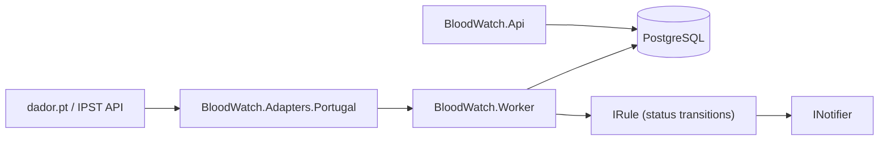

# BloodWatch Architecture

This document describes the current architecture: dador/IPST ingestion, latest-state Postgres persistence, local Docker workflow, and API/worker runtime topology.

> Disclaimer: No medical advice. BloodWatch reports public data and automation events only.

## Components

- `BloodWatch.Core`: Canonical contracts and models (`Snapshot`, `SnapshotItem`, `Metric`, `RegionRef`, `SourceRef`, `Event`, `Delivery`) and interfaces (`IDataSourceAdapter`, `IRule`, `INotifier`).
- `BloodWatch.Adapters.Portugal`: Portugal adapter for `dador.pt` API (`/api/blood-reserves`, `/api/institutions`, `/api/sessions`).
- `BloodWatch.Infrastructure`: EF Core + Npgsql persistence (`BloodWatchDbContext`), entities, and baseline migration.
- `BloodWatch.Api`: HTTP read/write surface + health endpoint + DB migration on startup.
- `BloodWatch.Worker`: Background ingestion, status transition evaluation, and dispatch pipeline.

## Runtime view

## Persistence schema

The baseline schema includes:
- `sources`
- `regions`
- `current_reserves` (status-only)
- `donation_centers`
- `collection_sessions`
- `subscriptions`
- `events`
- `deliveries`

Seed data includes one source record:
- Adapter key: `pt-dador-ipst`
- Name: `Portugal Dador/IPST`

## API contracts

- `GET /api/v1/reserves/latest` returns status-only reserve items (`statusKey`, `statusLabel`), without numeric value/unit.
- `GET /api/v1/institutions` and `GET /api/v1/institutions/nearest` expose donation center location data (`region` filter on `/institutions`).
- `GET /api/v1/sessions` returns upcoming donation sessions (`region` filter).
- Subscriptions support scopes:
  - `scopeType=region` + `region`
  - `scopeType=institution` + `institutionId`
- Subscription `metric` is optional:
  - explicit metric key for exact matching
  - wildcard (`null` in API, persisted as `*`) to match all metrics in scope
- Institution scope matching for reserve status events is region-backed: the institution's region is matched to event region.

## Local startup behavior

- Docker Compose manages `postgres`, `api`, and `worker`.
- `postgres` has a healthcheck (`pg_isready`) and persistent volume.
- `api` and `worker` depend on Postgres health and run DB migration retry logic at startup.
