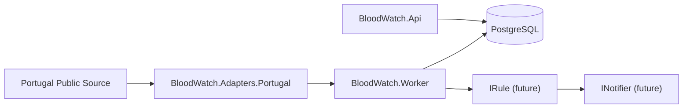

# BloodWatch Architecture

This document describes the M0 baseline architecture: ingestion contracts, latest-state Postgres persistence, local Docker workflow, and API/worker runtime topology.

> Disclaimer: No medical advice. BloodWatch reports public data and automation events only.

## Components

- `BloodWatch.Core`: Canonical contracts and models (`Snapshot`, `SnapshotItem`, `Metric`, `RegionRef`, `SourceRef`, `Event`, `Delivery`) and interfaces (`IDataSourceAdapter`, `IRule`, `INotifier`).
- `BloodWatch.Adapters.Portugal`: Portugal data source adapter implementing `IDataSourceAdapter`.
- `BloodWatch.Infrastructure`: EF Core + Npgsql persistence (`BloodWatchDbContext`), entities, initial migration, and seed data.
- `BloodWatch.Api`: HTTP surface + health endpoint + DB migration on startup.
- `BloodWatch.Worker`: Background process that executes adapters and prepares future rule/notification pipeline.

## Runtime view

## Persistence baseline

The initial schema includes:
- `sources`
- `regions`
- `current_reserves`
- `subscriptions`
- `events`
- `deliveries`

Seed data includes one source record:
- Adapter key: `pt-transparencia-sns`
- Name: `Portugal SNS Transparency`

## Local startup behavior

- Docker Compose manages `postgres`, `api`, and `worker`.
- `postgres` has a healthcheck (`pg_isready`) and persistent volume.
- `api` and `worker` depend on Postgres health and also run DB migration retry logic at startup.
